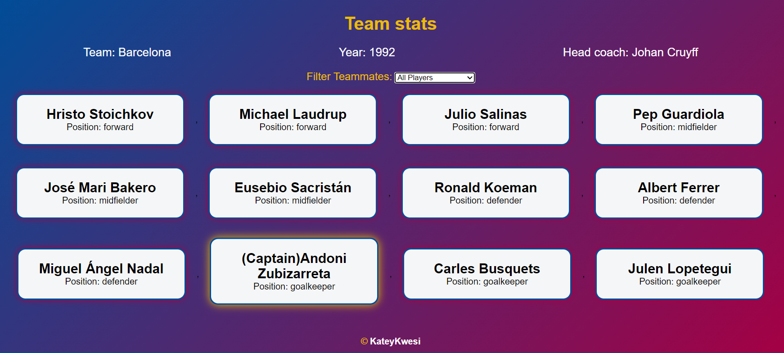

# ⚽ Football Team Card

A basic football team card project built to sharpen my skills in:

- DOM manipulation
- Object destructuring
- Event handling
- Data filtering

---

## 🚀 Demo

🔗 [Live Demo](https://kateykwesi.github.io/footballteamcard/)

---

## 📸 Preview



---

## ✨ Features

- Display key team details (team, year, head coach).
- Filter players dynamically by position (Forward, Midfielder, Defender, Goalkeeper).
- Responsive layout with styled player cards.
- Hover effects for player cards.

---

## 🛠️ Tech Stack

- **HTML5**
- **CSS3** (Barcelona-inspired theme 🎨)
- **JavaScript (ES6+)**

---

## 📂 How to Run Locally

```bash
# Clone the repository
git clone https://github.com/KateyKwesi/footballteamcard.git

# Navigate into the project
cd footballteamcard

# Open index.html in your browser


```
